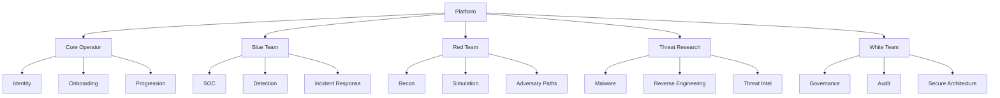

# Platform Backbone Plan

This document defines the long-term backbone for the cyber security platform so we can grow without accumulating fragile logic, duplicate data paths, or UI drift.

The goal is to move from a hybrid/demo-oriented application into a real product with:

- one source of truth
- one identity model
- one domain-capability model
- one learning/progression model
- one operational event model
- one design backbone with domain-specific skins

## 1. Current State Analysis

### 1.1 What exists today

The current codebase already has four strong product pillars:

1. `Home`
   - live operations surface
   - global threat map
   - live telemetry
   - response actions

2. `Community`
   - learning
   - labs
   - tools
   - CTF flow

3. `Sentinel`
   - reporting
   - review
   - CVE / breach / intelligence views

4. `Portfolio`
   - operator identity
   - certifications
   - education
   - profile progression

### 1.2 What the code tells us

From the current implementation:

- `C:\Users\salim\Desktop\GİTHUB PROJE\cybersec-blog\src\lib\soc-store-adapter.ts`
  - store selection is hybrid
  - identity/profile/reports can go to Supabase app-state JSON
  - alerts/live metrics still depend on sqlite/memory paths

- `C:\Users\salim\Desktop\GİTHUB PROJE\cybersec-blog\src\lib\soc-store-supabase.ts`
  - identity/profile/report state is stored as JSON objects in Supabase Storage
  - this is not the same thing as a relational database model

- `C:\Users\salim\Desktop\GİTHUB PROJE\cybersec-blog\src\lib\db.ts`
  - sqlite still defines many canonical tables
  - users, sessions, reports, profile, certification, education, alerts

- `C:\Users\salim\Desktop\GİTHUB PROJE\cybersec-blog\src\lib\portfolio-profile.ts`
  - current portfolio seed is already minimal, which is good
  - but the current seed model is still user-profile-centric, not domain-capability-centric

- `C:\Users\salim\Desktop\GİTHUB PROJE\cybersec-blog\src\lib\route-theme.ts`
  - theme routing already exists
  - this is a good foundation for future domain skins

### 1.3 Main architectural risks

The current hybrid model creates six serious long-term risks:

1. `state fragmentation`
   - same user can appear differently depending on store path

2. `partial persistence`
   - profile, avatar, certification, and report flows can drift apart

3. `migration risk`
   - every new feature must choose between sqlite, memory, storage JSON, and Supabase attack metrics

4. `permission drift`
   - role and capability checks are not centralized enough for future multi-domain work

5. `maintenance cost`
   - every new feature risks touching multiple persistence paths

6. `product expansion risk`
   - team/domain-based expansion will become brittle if we do not centralize around a real relational model

## 2. Product Direction

We are not building five disconnected apps.

We are building one platform with domain-specific workspaces.

That means:

- one login
- one user identity
- one canonical database
- multiple operational/learning domains

## 3. Domain Tree

The platform should be organized around a domain tree rather than a flat page list.



## 4. Domain Definitions

### 4.1 Core Operator

Purpose:

- entry point
- account identity
- profile
- certification and education
- base learning
- domain routing

This is not a weak home page.
This is the operator's control identity.

### 4.2 Blue Team

Purpose:

- telemetry
- triage
- incidents
- detection
- SOC workflow
- reporting

Existing surfaces that naturally belong here:

- `Home`
- most of `Sentinel`

### 4.3 Red Team

Purpose:

- offensive simulation
- recon
- attack path logic
- controlled labs
- adversary emulation

Existing surfaces that may evolve into it:

- parts of `Community`
- mission-based lab work

### 4.4 Threat Research

Purpose:

- malware analysis
- reverse engineering
- advanced threat intelligence
- black-box style research

This is the recommended professional replacement for a raw `Black Team` label.

### 4.5 White Team

Purpose:

- audit
- compliance
- governance
- security architecture
- policy workflows

## 5. Non-Negotiable System Principles

These principles are the backbone. If we break them, the project becomes harder to maintain later.

1. `single source of truth`
   - canonical state must live in Supabase Postgres

2. `storage is not database`
   - Supabase Storage must hold files only
   - avatars, certificate PDFs, report attachments
   - never JSON state

3. `one identity pipeline`
   - all auth/session/domain resolution must go through the same flow

4. `one capability resolver`
   - permissions, domains, tools, and training unlocks must resolve through one service layer

5. `one event pipeline`
   - telemetry -> incident -> report must be one data graph

6. `one shell, many skins`
   - consistent platform skeleton
   - domain-specific visual systems on top

## 6. Target Data Model

The platform should move to Supabase Postgres with relational schemas.

Recommended schema groups:

- `identity`
- `platform`
- `learning`
- `operations`
- `content`

The first concrete schema draft now lives here:

- `C:\Users\salim\Desktop\GİTHUB PROJE\cybersec-blog\supabase\platform-backbone-v1.sql`

### 6.1 identity schema

Tables:

1. `identity.users`
   - id
   - username
   - username_key
   - display_name
   - password_hash
   - status
   - created_at
   - updated_at

2. `identity.sessions`
   - token
   - user_id
   - ip_address
   - user_agent
   - created_at
   - last_seen_at
   - expires_at

3. `identity.user_domains`
   - id
   - user_id
   - domain_key
   - is_primary
   - access_level
   - created_at

4. `identity.user_preferences`
   - user_id
   - preferred_domain
   - dashboard_mode
   - mobile_density
   - locale
   - updated_at

### 6.2 platform schema

Tables:

1. `platform.profiles`
   - user_id
   - headline
   - bio
   - location
   - website
   - avatar_asset_id
   - updated_at

2. `platform.profile_specialties`
   - id
   - user_id
   - name
   - sort_order

3. `platform.profile_tools`
   - id
   - user_id
   - name
   - sort_order

4. `platform.certifications`
   - id
   - user_id
   - title
   - issuer
   - issue_date
   - expiry_date
   - credential_id
   - verify_url
   - status
   - notes
   - asset_id
   - sort_order

5. `platform.education_records`
   - id
   - user_id
   - institution
   - program
   - degree
   - start_date
   - end_date
   - status
   - description
   - sort_order

6. `platform.assets`
   - id
   - user_id
   - storage_path
   - mime_type
   - original_name
   - size_bytes
   - asset_kind
   - created_at

### 6.3 learning schema

Tables:

1. `learning.tracks`
   - id
   - domain_key
   - slug
   - title
   - description
   - difficulty
   - status

2. `learning.modules`
   - id
   - track_id
   - slug
   - title
   - description
   - sequence_no

3. `learning.lessons`
   - id
   - module_id
   - slug
   - title
   - mission_type
   - validation_mode
   - sequence_no

4. `learning.user_track_progress`
   - id
   - user_id
   - track_id
   - status
   - percent_complete
   - updated_at

5. `learning.user_lesson_progress`
   - id
   - user_id
   - lesson_id
   - status
   - attempts
   - evidence_json
   - completed_at

6. `learning.user_capability_unlocks`
   - id
   - user_id
   - domain_key
   - capability_key
   - unlocked_at

### 6.4 operations schema

Tables:

1. `operations.telemetry_events`
   - id
   - domain_key
   - source_ip
   - source_country
   - protocol
   - node
   - region
   - incident_type
   - severity
   - raw_context_json
   - occurred_at

2. `operations.incidents`
   - id
   - source_event_id
   - domain_key
   - status
   - severity
   - case_key
   - assignee_user_id
   - created_at
   - updated_at

3. `operations.incident_actions`
   - id
   - incident_id
   - actor_user_id
   - action_type
   - notes
   - metadata_json
   - created_at

4. `operations.reports`
   - id
   - incident_id
   - created_by_user_id
   - domain_key
   - title
   - content_markdown
   - severity
   - created_at
   - updated_at

5. `operations.report_tags`
   - id
   - report_id
   - tag

### 6.5 content schema

Tables:

1. `content.apt_profiles`
2. `content.cve_items`
3. `content.breach_history`
4. `content.domain_playbooks`
5. `content.tool_catalog`

## 7. Core Algorithms

This is the most important part. The platform backbone must be driven by explicit algorithms, not scattered UI conditionals.

### 7.1 Entry Resolution Algorithm

Purpose:

- determine where a user lands after login
- avoid ambiguous routing

Rules:

1. authenticate user
2. load primary domain
3. load user preferences
4. if explicit next route is valid, honor it
5. else route to preferred domain workspace
6. if no preferred domain, route to `Core Operator`

Pseudo flow:

```text
input: session_user, requested_target

load enabled_domains for session_user
load preferred_domain for session_user

if requested_target exists and requested_target in enabled_domains:
  return requested_target

if preferred_domain exists and preferred_domain in enabled_domains:
  return preferred_domain

return "core_operator"
```

### 7.2 Domain Access Resolution Algorithm

Purpose:

- decide what a user can see and do inside a domain

Inputs:

- user role
- domain memberships
- capability unlocks
- feature flags

Output:

- domain access object

```text
resolveDomainAccess(user_id, domain_key):
  membership = get user_domains row
  if no membership:
    return denied

  unlocks = get capability unlocks for user_id + domain_key
  prefs = get user preferences

  return {
    domain_key,
    access_level,
    can_view,
    can_operate,
    can_report,
    can_manage_content,
    unlocked_capabilities,
    ui_density,
    dashboard_preset
  }
```

### 7.3 Capability Resolution Algorithm

Purpose:

- centralize feature exposure

Capability examples:

- `telemetry.view`
- `telemetry.respond`
- `report.create`
- `report.publish`
- `lab.advanced`
- `malware.research`
- `governance.audit`

Rules:

1. capabilities may come from domain membership
2. capabilities may be extended by progression
3. capabilities may be restricted by access level
4. UI must ask capability resolver, not raw role strings

### 7.4 Learning Unlock Algorithm

Purpose:

- govern track/module/lesson progression

Rules:

1. a track belongs to one domain
2. a module is unlocked only if previous module threshold is passed
3. a lesson is unlocked only if prior lesson or prerequisite set is complete
4. specific capabilities unlock only when milestone conditions are met

```text
unlockLesson(user_id, lesson_id):
  prerequisites = get lesson prerequisites
  progress = get user lesson progress for prerequisites

  if all prerequisites complete:
    mark lesson available
  else:
    keep lesson locked
```

```text
unlockCapability(user_id, capability_key):
  conditions = capability definition
  if conditions.met_by(user progress, certifications, domain state):
    insert capability unlock
```

### 7.5 Incident Pipeline Algorithm

Purpose:

- unify telemetry, incidents, and reports

Flow:

1. event arrives in `operations.telemetry_events`
2. incident candidate is evaluated
3. if threshold reached, create/update incident
4. user may investigate, contain, dismiss, or report
5. report remains linked to incident and source event

```text
ingestTelemetry(event):
  persist event
  candidate = correlate event with recent event window

  if candidate.score >= threshold:
    incident = createOrUpdateIncident(candidate)
    attach event to incident

  return event_id, incident_id?
```

### 7.6 Report Generation Algorithm

Purpose:

- make reports deterministic and linked to operational context

Rules:

1. report creation must always link to event or incident
2. report tags derive from incident context first, manual edits second
3. Sentinel reads reports from the same incident graph

```text
createReport(source):
  assert source is telemetry_event or incident
  hydrate context
  derive tags
  derive severity
  persist report
  persist report_tags
```

### 7.7 Theme Resolution Algorithm

Purpose:

- guarantee one shell, many skins

Rules:

1. current route maps to domain or core workspace
2. domain maps to theme token set
3. components consume semantic tokens, not hard-coded colors

```text
resolveTheme(route, domain_key):
  if route overrides domain:
    return route theme
  return theme for domain_key
```

### 7.8 Responsive Composition Algorithm

Purpose:

- preserve information hierarchy across desktop/tablet/mobile

Rules:

1. same decision order across all breakpoints
2. desktop may show more parallel context
3. mobile must not reorder decision priority

Decision order:

1. awareness
2. selection
3. context
4. action

On desktop:

- map on top
- telemetry below
- context parallel

On mobile:

- map on top
- telemetry below
- selected row expands vertically
- actions remain attached to selected event

## 8. UI / Product Backbone Rules

### 8.1 Shell rule

Persistent shell, route-local engines.

That means:

- top nav persistent
- auth shell persistent
- heavy live engines only inside the page that needs them

### 8.2 Navigation rule

Top-level navigation must always remain:

- SPA-based
- prefetched
- hydration-safe

### 8.3 Design rule

Each domain may have:

- unique palette
- unique motion style
- unique operational metaphors

But all domains must share:

- spacing rhythm
- component skeleton
- form language
- action hierarchy
- responsive logic

## 9. Migration Plan

We should not migrate everything in one reckless sweep.

### Phase A - Freeze the truth model

1. define final Postgres schema
2. define capability keys
3. define domain keys
4. define routing rules

Deliverable:

- SQL migrations
- typed service contracts

### Phase B - Identity migration

1. move canonical user/session model to Postgres
2. stop writing identity state to storage JSON
3. keep file assets in Storage only

Deliverable:

- `identity.users`
- `identity.sessions`
- `identity.user_domains`
- `identity.user_preferences`

### Phase C - Platform profile migration

1. move profile/certifications/education to Postgres
2. map asset references to `platform.assets`
3. remove profile JSON state writes

Deliverable:

- `platform.*` tables live
- portfolio reads/writes only Postgres + Storage assets

### Phase D - Operations migration

1. move reports to `operations.reports`
2. unify incidents and telemetry graph
3. rewire Home + Sentinel to same relational source

Deliverable:

- one operational graph

### Phase E - Learning migration

1. convert curriculum/labs to track/module/lesson structure
2. persist progress in `learning.*`
3. begin domain-based unlocks

Deliverable:

- team/domain progression becomes real

### Phase F - Domain expansion

1. Core Operator
2. Blue Team
3. Red Team
4. Threat Research
5. White Team

## 10. What We Should Not Do

To keep the backbone clean, we should explicitly avoid these mistakes:

1. do not add new stateful features to Storage JSON
2. do not create separate login systems per team
3. do not let raw role strings drive the UI
4. do not fork component systems per domain
5. do not use demo seed content as if it were real user data
6. do not let mobile become a separate product logic

## 11. Immediate Decisions We Should Lock

These are the first decisions we should freeze before implementation:

1. canonical domain keys
   - `core_operator`
   - `blue_team`
   - `red_team`
   - `threat_research`
   - `white_team`

2. storage policy
   - Postgres for state
   - Storage only for files

3. capability policy
   - UI reads capability resolver, never raw role only

4. routing policy
   - one login
   - route to domain workspace after auth

5. rollout policy
   - first real rollout: `core_operator + blue_team + red_team`

## 12. Next Working Session

The next real implementation step should be:

1. create SQL schema draft for Supabase Postgres
2. define domain keys and capability keys in code
3. design `DomainAccessResolver`
4. design `CapabilityResolver`
5. map current screens into future domains

That gives us a strong enough backbone to start implementation without guessing.

## 13. Phase 1 Migration Order

To keep runtime risk low, the first production migration should happen in this order:

1. `identity.users`
2. `identity.sessions`
3. `content.portfolio_profiles`
4. `content.profile_specialties`
5. `content.profile_tools`
6. `content.portfolio_certifications`
7. `content.portfolio_education`
8. `operations.reports`
9. `operations.report_actions`

This deliberately avoids moving live telemetry and incidents first.
We stabilize the identity/profile/report backbone before touching the heavier operational stream.
