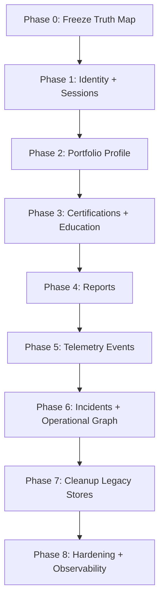

# Postgres Migration Execution Roadmap

This document turns the migration direction into an execution plan.

The goal is not only to migrate data.
The goal is to migrate **without breaking user flows, without lowering product quality, and without introducing hidden data loss risk**.

---

## North Star

When this roadmap is complete:

- `Supabase Postgres` is the only source of truth for product data
- `Supabase Storage` is used only for files and binary assets
- `sqlite` is no longer production truth
- `memory` remains dev/test fallback only
- every critical user-facing flow has rollback-safe cutover steps

---

## Migration Guardrails

These rules are non-negotiable.

1. `No big-bang migration`
   - every major domain moves behind a feature flag or explicit cutover gate

2. `No dual ambiguity`
   - during each phase, one runtime path is primary and one is compatibility-only

3. `No migration without verification`
   - each phase needs:
     - schema verification
     - data backfill verification
     - runtime smoke tests
     - rollback path

4. `No product regression`
   - UX and operational behavior must remain unchanged unless intentionally improved

5. `Storage stays for files only`
   - JSON state is a temporary compatibility bridge, not an end-state

---

## Phase Map



---

## Phase 0: Freeze Truth Map

### Purpose

Make sure we know exactly what data exists, where it lives, and what “correct” means before we move anything.

### Status

Already started.

### Deliverables

- [data-flow-map-and-migration-plan.md](C:\Users\salim\Desktop\GİTHUB%20PROJE\cybersec-blog\docs\data-flow-map-and-migration-plan.md)
- [platform-backbone-v1.sql](C:\Users\salim\Desktop\GİTHUB%20PROJE\cybersec-blog\supabase\platform-backbone-v1.sql)
- updated [README.md](C:\Users\salim\Desktop\GİTHUB%20PROJE\cybersec-blog\README.md)

### Done criteria

- every major data domain is mapped
- every target table exists in the SQL backbone draft
- outdated repo summary is removed

---

## Phase 1: Identity + Sessions

### Purpose

Move `users` and `sessions` to Postgres first, because identity is the safest and most important first relational backbone.

### Scope

- login
- register
- session lookup
- session cleanup
- admin user creation
- assignable user listing

### Current implementation status

Partially completed:

- feature-flagged Postgres identity runtime exists
- default runtime still remains unchanged
- shadow sync into app-state is available

### Remaining tasks

1. create and apply `identity` tables in Supabase
2. write `users/sessions` backfill script
3. verify current users in Postgres
4. run local smoke tests with:
   - `SOC_IDENTITY_STORE=postgres`
5. verify:
   - login
   - register
   - logout
   - session restore
   - admin user creation
6. validate shadow sync still keeps profile/report surfaces stable

### Verification checklist

- existing account can log in
- new account can register
- session cookie resolves correctly
- page refresh preserves session
- admin can create a user
- `/api/auth/session` returns expected shape
- `/api/users` still works

### Backfill operator flow

```bash
npm run backfill:identity
npm run backfill:identity -- --apply
```

After apply:

1. run the printed `setval(...)` SQL in Supabase SQL editor
2. switch `SOC_IDENTITY_STORE=postgres`
3. run the verification checklist above

### Rollback

- set `SOC_IDENTITY_STORE=supabase`
- runtime falls back to current Storage JSON identity path

### Done criteria

- all auth/session routes work with Postgres enabled
- no user-facing regression
- shadow compatibility confirmed

---

## Phase 2: Portfolio Profile

### Purpose

Move the base profile record into Postgres while keeping avatars in Storage.

### Scope

- headline
- bio
- location
- website
- specialties
- tools
- avatar metadata

### Target tables

- `content.portfolio_profiles`
- `content.profile_specialties`
- `content.profile_tools`

### Tasks

1. implement Postgres profile repository
2. add feature flag or phased adapter routing
3. backfill profile JSON into relational tables
4. preserve avatar asset paths from Storage
5. test profile read/update flows

### Verification checklist

- `/portfolio` loads correctly
- profile edit saves correctly
- specialties render in same order
- tools render in same order
- avatar still displays correctly

### Rollback

- route reads back to existing JSON profile path

### Done criteria

- profile data no longer depends on JSON app-state for primary truth

---

## Phase 3: Certifications + Education

### Purpose

Move structured portfolio records into relational tables and leave only files in Storage.

### Scope

- certifications
- certification assets metadata
- education records

### Target tables

- `content.portfolio_certifications`
- `content.portfolio_education`

### Tasks

1. implement certification repository
2. implement education repository
3. backfill JSON certification/education objects
4. preserve file paths for certificate assets
5. verify sort order

### Verification checklist

- create certification
- update certification
- delete certification
- education CRUD still works
- certificate asset links still resolve

### Done criteria

- structured credential/education data is relational
- Storage is only asset storage here

---

## Phase 4: Reports

### Purpose

Move reports out of Storage JSON and into the operational relational graph.

### Scope

- report creation
- report listing
- report archive
- report action trail

### Target tables

- `operations.reports`
- `operations.report_actions`

### Tasks

1. implement Postgres report repository
2. migrate current `active + archived` report state
3. backfill tags and content
4. preserve archive history
5. remove report JSON as production truth

### Verification checklist

- Sentinel report list loads
- `Raporu Oku` works
- archive flow works
- active/archive filters work
- report content remains intact

### Rollback

- switch report adapter back to current JSON path

### Done criteria

- reports are fully relational
- archive flow remains stable

---

## Phase 5: Telemetry Events

### Purpose

Move raw/normalized event flow into relational telemetry tables.

### Scope

- telemetry events
- attack metadata
- source/region/node context

### Target tables

- `operations.telemetry_events`

### Tasks

1. define canonical event shape
2. map current simulated event payloads to relational form
3. implement write path to Postgres
4. preserve current UI behavior
5. verify timeline ordering and filtering

### Verification checklist

- live telemetry still renders smoothly
- filters behave the same
- event ordering is preserved
- no repeated-event regression introduced by migration

### Done criteria

- telemetry persistence no longer depends on sqlite for truth

---

## Phase 6: Incidents + Operational Graph

### Purpose

Unify telemetry, incidents, and reports into a single relational operational model.

### Scope

- incident creation
- incident state transitions
- telemetry -> incident linkage
- incident -> report linkage

### Target tables

- `operations.incidents`
- `operations.reports`
- `operations.telemetry_events`

### Tasks

1. formalize current incident action model
2. move incident state transitions to Postgres
3. link reports to incidents relationally
4. unify analytics and related-event logic

### Verification checklist

- telemetry actions still work
- incident state transitions remain correct
- report generation from telemetry remains intact
- Sentinel and Home stay visually unchanged

### Done criteria

- the operational graph becomes relational and queryable end-to-end

---

## Phase 7: Cleanup Legacy Stores

### Purpose

After relational cutovers are proven, remove production dependency on old paths.

### Scope

- Storage JSON state writes
- sqlite production truth
- dead compatibility glue

### Tasks

1. disable JSON identity writes in production path
2. disable profile/report JSON primary writes
3. reduce sqlite to local/dev-only or remove where appropriate
4. remove stale adapter branches
5. clean old migration shims

### Done criteria

- no product-critical runtime path depends on Storage JSON for truth
- no production-critical path depends on sqlite

---

## Phase 8: Hardening + Observability

### Purpose

Make sure the new backbone is not only correct, but production-strong.

### Scope

- RLS
- audit
- backup/restore
- monitoring
- data lifecycle

### Tasks

1. define RLS strategy per schema
2. add audit coverage where needed
3. test backup + restore process
4. add query/error monitoring
5. define retention + archive policies

### Done criteria

- restore procedure is documented and tested
- audit trail coverage is acceptable
- data protection posture is production-ready

---

## Cross-Phase Testing Rules

Every phase must pass these before cutover:

1. `build`
   - `npm run build`

2. `route smoke`
   - affected UI routes open

3. `API smoke`
   - affected API routes return expected shape

4. `visual smoke`
   - no visible regression in the touched surfaces

5. `rollback drill`
   - feature flag or fallback can restore previous runtime behavior

---

## Recommended Immediate Next Step

The best next implementation step is:

### `Phase 1 Backfill`

1. apply [platform-backbone-v1.sql](C:\Users\salim\Desktop\GİTHUB%20PROJE\cybersec-blog\supabase\platform-backbone-v1.sql) to Supabase
2. write a `users/sessions` backfill script
3. run local verification with `SOC_IDENTITY_STORE=postgres`
4. only after that, continue to profile migration

---

## Definition Of Success

This migration is successful only if:

- users never notice broken flows
- profile/report behavior stays stable during transition
- data ownership becomes simpler after each phase
- repo complexity goes down, not up
- each phase leaves us in a safer place than before
